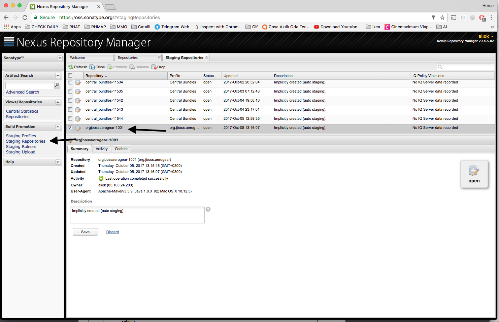
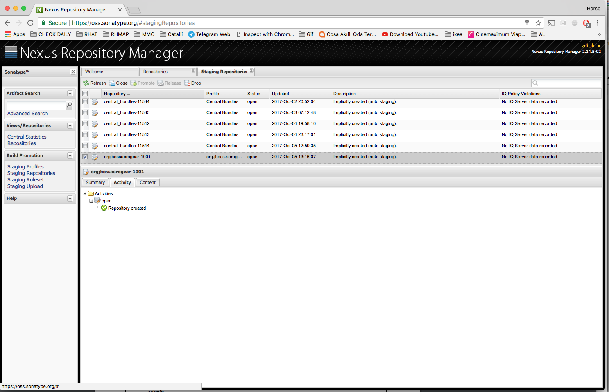
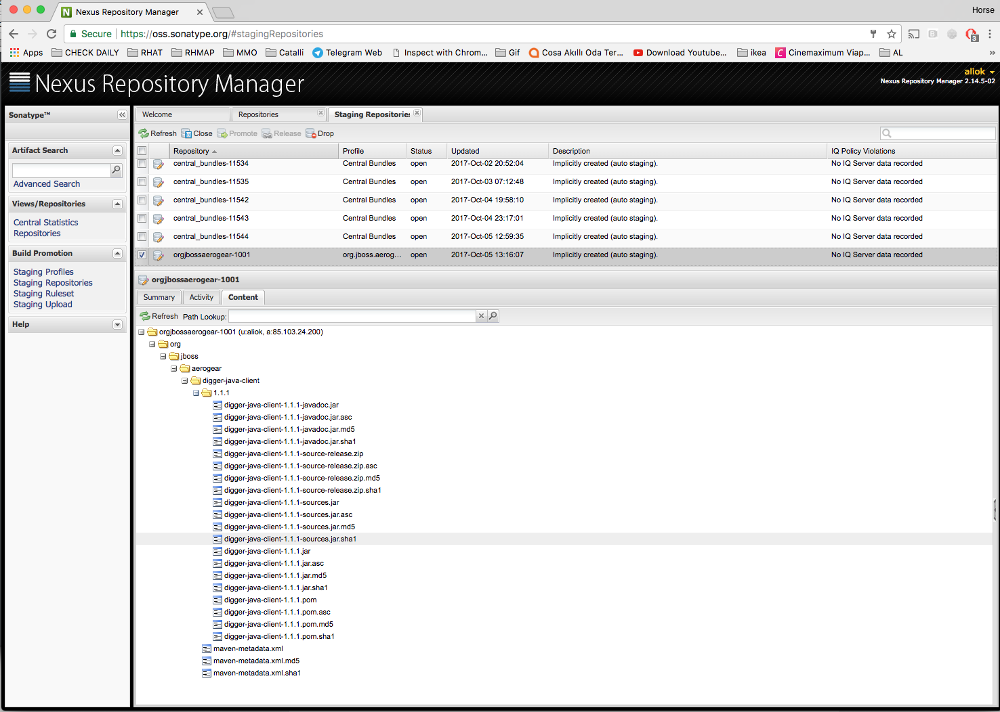
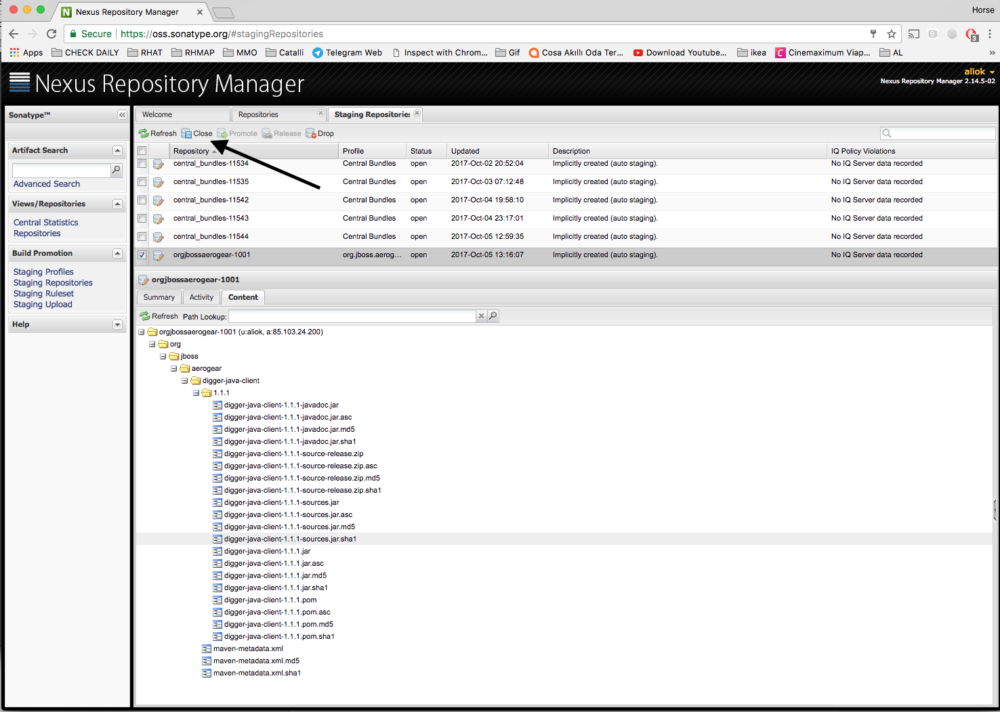
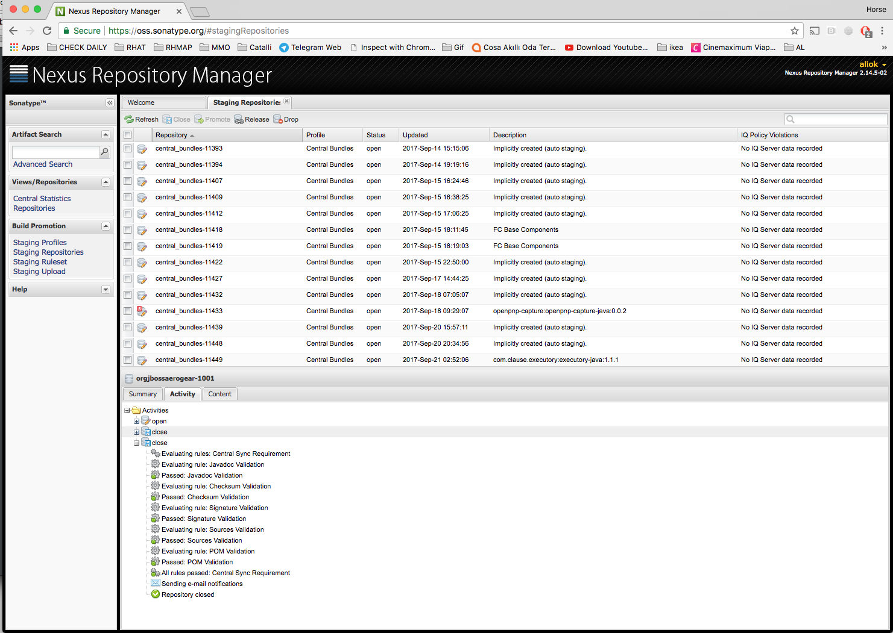

# Releasing AeroGear Digger Java Client

### Big Picture

* We release to Sonatype Nexus.
* That syncs with Maven Central.
* We don't use JBoss Nexus as it is slower and there is no need for that if we are able to publish to Sonatype.

A more general document with no Sonatype inststructions: https://github.com/aerogear/collateral/wiki/Release-Process-(Java)

## Requirements

1. GPG Setup
2. Sonatype Nexus account

#### Requirement - GPG Setup

Have gpg-agent installed, configured and running.

See these instructions from Github for the complete setup: https://help.github.com/articles/signing-commits-with-gpg/

One way to be sure to check if your gpg agent is running correctly is to encrypt and decrypt a file, using the ```gpg``` tool, don't forget to pass the ```--use-agent``` option, you should be prompted with a dialog (depending on your OS asking for your pass phrase). Now try to decrypt again, you should not be asked again for your pass phrase : your agent is working.

```
echo "Hello" > doc.txt
gpg --output doc.gpg --encrypt --recipient <your-gpg-email-address> doc.txt
gpg --output doc2.txt --decrypt doc.gpg
```

Contents of doc.txt and doc2.txt should be the same.

Submit your PGP key to https://pgp.mit.edu/ . This is required by Sonatype Nexus!

Find your key and get the armored key:
```
$  gpg --list-keys

   /Users/ali/.gnupg/pubring.gpg
   -----------------------------
   pub   4096R/10CAEE00 2017-09-25
   uid       [ultimate] Ali Ok (Ali's GPG key) <aliok@apache.org>
   sub   4096R/3E608DB2 2017-09-25

$  gpg --armor --export 10CAEE00

    -----BEGIN PGP PUBLIC KEY BLOCK-----
    Version: GnuPG v2

    mQINBFnI6gsBEAC43ZrS75PAbQCQpvOm70oTMwOPbKaNWqCQLxDR/ck7whBpO9wo
    ...
    2rS1FJUwRsqi
    =CoyC
    -----END PGP PUBLIC KEY BLOCK-----
```

Copy the block (including the `--------BEGIN...` and `-----END...` lines) and paste it to https://pgp.mit.edu/ and submit.

#### Requirement - Sonatype Nexus account

If you would like to have a fast sync with Maven central, Sonatype's OSS Nexus is the way to go.

1. Create Sonatype account here: https://issues.sonatype.org/secure/Signup!default.jspa
2. Check if login works to Nexus: https://oss.sonatype.org/
3. Ask for publishing permissions for the `groupId` (in pom.xml) of the project you want to publish. Ask @passos or @matzew to add a comment to one of these tickets:
   * `groupId org.aerogear`: https://issues.sonatype.org/browse/OSSRH-34060
   * `groupId org.jboss.aerogear`: https://issues.sonatype.org/browse/OSSRH-20598

## Setup

1. GPG
2. Maven Security
3. Sonatype Nexus

#### Setup - GPG

Make sure GPG works as described in the requirements section.
Add your gpg secret key id to your global git config : ```git config --global user.signingkey YOURKEYID```

#### Setup - Maven Security

Set up the password encryption for Maven, you can follow these instructions : http://maven.apache.org/guides/mini/guide-encryption.html

Make sure you created a master password.

### Setup - Sonatype Nexus

First of all, make sure your pom.xml is conforming the requirements of Sonatype: http://central.sonatype.org/pages/apache-maven.html

In order to publish to Sonatype Nexus, have this section in your pom.xml file:

```
    <distributionManagement>
        <snapshotRepository>
            <id>ossrh</id>
            <url>https://oss.sonatype.org/content/repositories/snapshots</url>
        </snapshotRepository>
        <repository>
            <id>ossrh</id>
            <url>https://oss.sonatype.org/service/local/staging/deploy/maven2/</url>
        </repository>
    </distributionManagement>
```

Encrypt your Sonatype password:
```
mvn --encrypt-password <the password>
> {COQLCE6DU6GtcS5P=}
```

Use that password in your `~/.m2/settings.xml`:

```
<settings>
  <servers>
    ...
    <server>
      <id>ossrh</id>
      <username>YOUR_USERNAME</username>
      <password>{COQLCE6DU6GtcS5P=}</password>
    </server>
    ...
  </servers>
</settings>

```

## Testing by releasing snapshots

You can test if things work correctly by releasing a snapshot.

This tests two things:
* upload to the Nexus repository works
* your GPG settings are working and you are able to sign the artifacts


**Make sure you have `-SNAPSHOT` appended to the version in pom.xml.**
If there is no `-SNAPSHOT`, you might publish a real release!

Run
```
MAVEN_OPTS="-DperformRelease=false" mvn clean deploy -P release-sign-artifacts
```

This will publish a signed snapshot release. Go to e.g. https://oss.sonatype.org/content/repositories/snapshots/org/jboss/aerogear/digger-java-client/1.1.1-SNAPSHOT/
to check if there are `<artifact>`, `<artifact>.asc`, `<artifact>.sha1` and `<artifact>.md5` files available for artifacts
`.jar`, `.pom`, `-javadoc.jar` and `-sources.jar`.

Example:
```
digger-java-client-1.1.1-20171005.090531-4-javadoc.jar           Thu Oct 05 09:05:36 UTC 2017    120127
digger-java-client-1.1.1-20171005.090531-4-javadoc.jar.asc       Thu Oct 05 09:05:40 UTC 2017    819
digger-java-client-1.1.1-20171005.090531-4-javadoc.jar.md5       Thu Oct 05 09:05:36 UTC 2017    32
digger-java-client-1.1.1-20171005.090531-4-javadoc.jar.sha1      Thu Oct 05 09:05:36 UTC 2017    40
digger-java-client-1.1.1-20171005.090531-4-sources.jar           Thu Oct 05 09:05:34 UTC 2017    20240
digger-java-client-1.1.1-20171005.090531-4-sources.jar.asc       Thu Oct 05 09:05:39 UTC 2017    819
digger-java-client-1.1.1-20171005.090531-4-sources.jar.md5       Thu Oct 05 09:05:35 UTC 2017    32
digger-java-client-1.1.1-20171005.090531-4-sources.jar.sha1      Thu Oct 05 09:05:35 UTC 2017    40
digger-java-client-1.1.1-20171005.090531-4.jar                   Thu Oct 05 09:05:31 UTC 2017    24858
digger-java-client-1.1.1-20171005.090531-4.jar.asc               Thu Oct 05 09:05:37 UTC 2017    819
digger-java-client-1.1.1-20171005.090531-4.jar.md5               Thu Oct 05 09:05:32 UTC 2017    32
digger-java-client-1.1.1-20171005.090531-4.jar.sha1              Thu Oct 05 09:05:32 UTC 2017    40
digger-java-client-1.1.1-20171005.090531-4.pom                   Thu Oct 05 09:05:32 UTC 2017    7053
digger-java-client-1.1.1-20171005.090531-4.pom.asc               Thu Oct 05 09:05:38 UTC 2017    819
digger-java-client-1.1.1-20171005.090531-4.pom.md5               Thu Oct 05 09:05:32 UTC 2017    32
digger-java-client-1.1.1-20171005.090531-4.pom.sha1              Thu Oct 05 09:05:32 UTC 2017    40
```

In order to use any snapshot in your dependent project, you need to have Sonatype snapshot repo in your dependent project
as the snapshots are not synced to Maven central.

```
<repositories>
    ...
    <repository>
        <id>ossrh</id>
        <name>Sonatype OSS Snapshot Repository</name>
        <url>http://oss.sonatype.org/content/repositories/snapshots</url>
        <releases>
            <enabled>false</enabled>
        </releases>
        <snapshots>
            <enabled>true</enabled>
        </snapshots>
    </repository>
    ...
<repositories>
```


## Release process

Overview:
* We use Maven release plugin to bump versions and etc.
* We first bump version and tag things locally, then push to GitHub, then do the release to Sonatype

#### Prepare

While on master branch, with a `-SNAPSHOT` appended to the version in pom.xml, run this:

```
mvn clean
mvn release:prepare -Dtag=tag
```

_**NOTE:**_  The tag should only be the version number like `mvn release:prepare -Dtag=0.2.21`

The release plugin does lots of thing for you like bumping to the next snapshot version and checking files, you can do
a `git status` and check the differences.


#### Sign the Git tag

   * Note the commit git is pointing (commit_SHA_of_the_prepare_release): `git show --name-status x.y.z`
   * Delete the tag : ```git tag -d x.y.z```
   * Recreate the tag signing it : ```git tag -s x.y.z <commit_SHA_of_the_prepare_release> -m "signed MY ARTIFACT x.y.z tag"```
   * Make sure you signed the correct commit 

   * Verify that you really singed the tag, by executing ```git tag -v x.y.z```. The output should be similar to:
```
        object ac05cd2a4ed8b6ef354acdf17fff321f33548997
        type commit
        tag 0.2.1
        tagger Matthias Wessendorf <matzew@apache.org> 1375864277 +0200

        signed unified push java client 0.2.1 tag
        gpg: Signature made Wed Aug  7 10:31:17 2013 CEST using DSA key ID 1CE17EDC
        gpg: Good signature from "Matthias Wessendorf <matzew@apache.org>"
```

   * (Optional) Go to your Github profile page and add or make sure you GPG public key is added. Going to [release tab](https://github.com/aerogear/aerogear-parent/releases/tag/0.2.21) you will show a `Verified` label.
   * If all went OK, push the tag
```
git push origin x.y.z
```
where x.y.z is the release tag.

**Note:** The delete and recreate tasks are a workaround of this [bug](http://jira.codehaus.org/browse/SCM-486) .

**Note 2:** You don't need to push the changes on master, only the tag. (already tested)

#### Perform the Release

While you're still on master branch, do this:

```
        MAVEN_OPTS="-DperformRelease=true -Dgpg.useagent=true" mvn release:perform
```

#### Stage on Nexus

Go to the staging repository and check if the artifact was corrected uploaded.

* Go to https://oss.sonatype.org/#stagingRepositories
* There must be a repository called something like `orgjbossaerogear-1001` which is implicitly created by auto staging
* Check the summary, activity and content and make sure things are correct
* In the content, make sure you can see sources and javadocs are published as well
* In the content, make sure you can see `.asc` files for every published artifact

These are some screenshots:





* Close the repository to stage ("close" could sound confusing but in fact it means your repository will be staged).



* Press the "Refresh" button next to "Close" to check the status. Eventually, if everything is fine,
  you will see this:



* Communicate on the mailing list the repository URL.

* Be sure to have git-extras installed, this way you can easily generate a change log by running ```git changelog``` , that will create an history.md file containing your changelog.

In the body of your email make sure to mention :
* The new version that has been released
* The staging repo location (sth like https://oss.sonatype.org/content/repositories/orgjbossaerogear-1001, shown above in the screenshots)
* The changelog


Now, wait until the staging is done, tests have been successful and community gave approval (or gave no feedback within 72 hours).


#### Push the changes performed by maven plugin

**Note:** You only do this step once the staging is done, tests have been successful and community gave approval (or gave no feedback within 72 hours).

```
git push origin master
```

#### Publishing the staged release

**Note:** You only do this step once the staging is done, tests have been successful and community gave approval (or gave no feedback within 72 hours).

The artifact will be literary released. To do that just push the "Release" button next to "Close" button shown above in the screenshots.

Check e.g. here for the release artifacts: https://oss.sonatype.org/content/groups/public/org/jboss/aerogear/digger-java-client/1.1.1/

Sonatype OSS Nexus to synchronize with Maven central repo could take up to 2 days (should be 2-3 hours generally).
Search for [your release in maven central](http://search.maven.org/#search%7Cga%7C1%7Cg%3A%22org.jboss.aerogear%22%20AND%20a%3A%22digger-java-client%22).
